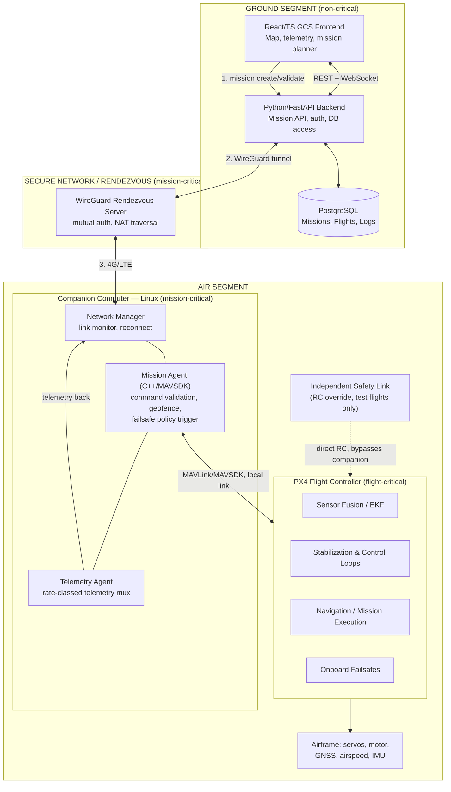

# Architecture

## 1. Concept

A PC-based Ground Control Station (GCS) composes and validates missions and sends high-level, application-level commands (never raw control-surface commands) over a secured 4G/LTE link to a Linux companion computer onboard the aircraft. The companion computer relays validated commands to a PX4 flight controller via MAVSDK/MAVLink, which performs all real-time stabilization, navigation, and failsafe behavior. The aircraft remains safe and continues or gracefully aborts its mission with zero dependency on the cellular link, the ground backend, or the browser.

## 2. System Diagram



## 3. Major Components

| Component | Role |
|---|---|
| GCS Frontend (React/TS) | Mission planning UI, live map, telemetry/safety panels. Talks only to our backend API, never to PX4 directly. |
| GCS Backend (Python/FastAPI) | Terminates operator auth, mission CRUD + validation, converts app-level commands to protocol messages, stores flight logs, exposes WebSocket for live telemetry. |
| PostgreSQL | Persists Aircraft, Mission, Flight, TelemetrySample, SystemEvent, Command, CommandAck — the audit trail. |
| WireGuard rendezvous server | Always-on VPS with a static IP. Both GCS backend and companion computer dial outbound WireGuard tunnels to it, solving the "UAV has no public IP / sits behind carrier NAT" problem. |
| Network Manager (companion, C++) | Owns the LTE/WireGuard interface state, detects link loss/restoration, exposes link-quality metrics. |
| Mission Agent (companion, C++/MAVSDK) | Validates every inbound command (identity, timestamp, schema, current-state legality, geofence) before it reaches MAVSDK/PX4. Owns the failsafe policy state machine (see `SAFETY.md`). |
| Telemetry Agent (companion, C++) | Subscribes to MAVLink streams, buckets them into rate classes, forwards over the WireGuard tunnel, buffers/drops intelligently under bad links. |
| PX4 Flight Controller | Stabilization, sensor fusion, actuator output, navigation, and PX4's own built-in failsafes (RC loss, GPS loss, battery). |
| Independent Safety Link | Conventional RC link direct to the flight controller for real-world test flights, independent of the companion computer/LTE path. |

## 4. Criticality Separation

| Tier | Components | Consequence if it disappears |
|---|---|---|
| Flight-critical | PX4 stabilization/nav/EKF loops, PX4 built-in failsafes, RC safety link (test phase) | Aircraft cannot be trusted in the air — no acceptable failure mode |
| Mission-critical | Companion mission agent, geofence validation, command auth, failsafe policy selection, network manager | Loss degrades to PX4's own conservative built-in failsafe (e.g., RTL); aircraft remains safe, mission is aborted |
| Non-critical | GCS frontend, GCS backend, database, WireGuard rendezvous server, analytics/replay tooling | Operator loses visibility/control input; flight behavior is entirely unaffected |

## 5. Technology Stack

| Layer | Choice | Reasoning |
|---|---|---|
| Flight controller firmware | PX4, current stable release | Mature fixed-wing support, active failsafe logic, large community. |
| GCS Frontend | React + TypeScript, MapLibre GL | Existing skill; MapLibre avoids Google Maps licensing/key issues. |
| GCS Backend | Python + FastAPI | Async-native for WebSocket telemetry fan-out; shared language with simulation/analysis tooling. |
| Onboard Mission Agent | C++ + MAVSDK | Deliberate C++ learning vehicle; MAVSDK gives a typed abstraction over MAVLink. |
| Protocol/schema | JSON now (JSON Schema in `shared/schemas/`), migrate to Protobuf once the message set stabilizes | Fast iteration first, typed codegen later without a rewrite. |
| Ground-to-air networking | WireGuard | Self-hosted, kernel-level, auditable trust chain; solves NAT/dynamic-IP by having both ends dial out to a known rendezvous point. |
| Database | PostgreSQL | Relational integrity for Mission/Flight/Command auditability. |
| CI | GitHub Actions | Integrates directly with GitHub Issues/PRs. |

## 6. Data Flow

```mermaid
sequenceDiagram
    participant Op as Operator (Browser)
    participant BE as GCS Backend
    participant NET as WireGuard Tunnel
    participant MA as Mission Agent (Companion)
    participant PX4 as PX4 (MAVSDK)

    Op->>BE: Draw HOME→A→B→C→HOME, submit mission
    BE->>BE: Validate schema, geofence, size
    BE->>NET: MissionUpload (signed, versioned)
    NET->>MA: forward (encrypted+authenticated)
    MA->>MA: Validate identity, timestamp, geofence, state
    MA->>PX4: upload_mission() via MAVSDK
    PX4-->>MA: mission accepted
    MA-->>NET: COMMAND_ACCEPTED
    NET-->>BE: ack
    BE-->>Op: "Mission received"

    Op->>BE: MissionStart
    BE->>NET->>MA: forward
    MA->>PX4: start_mission()
    PX4-->>MA: PX4_ACTION_STARTED

    loop During flight
        PX4-->>MA: telemetry (attitude, position, battery...)
        MA-->>NET: rate-classed telemetry frames
        NET-->>BE: forward
        BE-->>Op: WebSocket push -> map/panels update
    end

    Note over NET,MA: If LTE drops here, PX4 continues<br/>the already-uploaded mission;<br/>MA applies local failsafe policy
```

## 7. Development Roadmap

| Phase | Focus |
|---|---|
| 0 | Software architecture |
| 1 | PX4 fixed-wing SITL simulation running standalone |
| 2 | Custom GCS (frontend+backend) connected to SITL via MAVSDK |
| 3 | Mission upload through our own application API |
| 4 | Simulated 4G/IP network architecture |
| 5 | Network failure simulation (latency/loss/outage injection) |
| 6 | Failsafe state machine testing under injected faults |
| 7 | Hardware-in-the-loop / bench testing |
| 8 | Physical aircraft integration |
| 9 | Controlled, lawful VLOS flight testing |

## 8. System Requirements (initial set)

| ID | Requirement |
|---|---|
| SYS-FLT-001 | The aircraft shall maintain stabilized flight without an active cellular connection. |
| SYS-FLT-002 | The aircraft shall complete a previously uploaded and validated mission without requiring further ground commands. |
| SYS-NET-001 | Loss of LTE connectivity shall not directly terminate the onboard flight-control process. |
| SYS-NET-002 | The companion computer shall detect link loss within a bounded time and report it as an `LTE_LOST` event to the mission agent. |
| SYS-SEC-001 | The system shall reject unauthenticated remote commands. |
| SYS-SEC-002 | The system shall reject commands with a stale or previously-used `command_id`/timestamp (replay protection). |
| SYS-MIS-001 | The system shall validate mission waypoints against the configured geofence before acceptance. |
| SYS-MIS-002 | The system shall reject a command that is not valid for the aircraft's current flight state. |
| SYS-LOG-001 | The system shall persist significant command and flight-state events with timestamps sufficient to reconstruct a flight timeline. |
| SYS-SAF-001 | Real-world flight testing shall provide an independent safety-override capability that does not depend on the companion computer or LTE link. |

Each requirement maps to at least one test (unit/integration/simulation/HIL/flight); the traceability matrix will live alongside `TESTING.md` as tests are added.

See [`SAFETY.md`](SAFETY.md) for the failsafe state machine and [`NETWORKING.md`](NETWORKING.md) for the security architecture.
