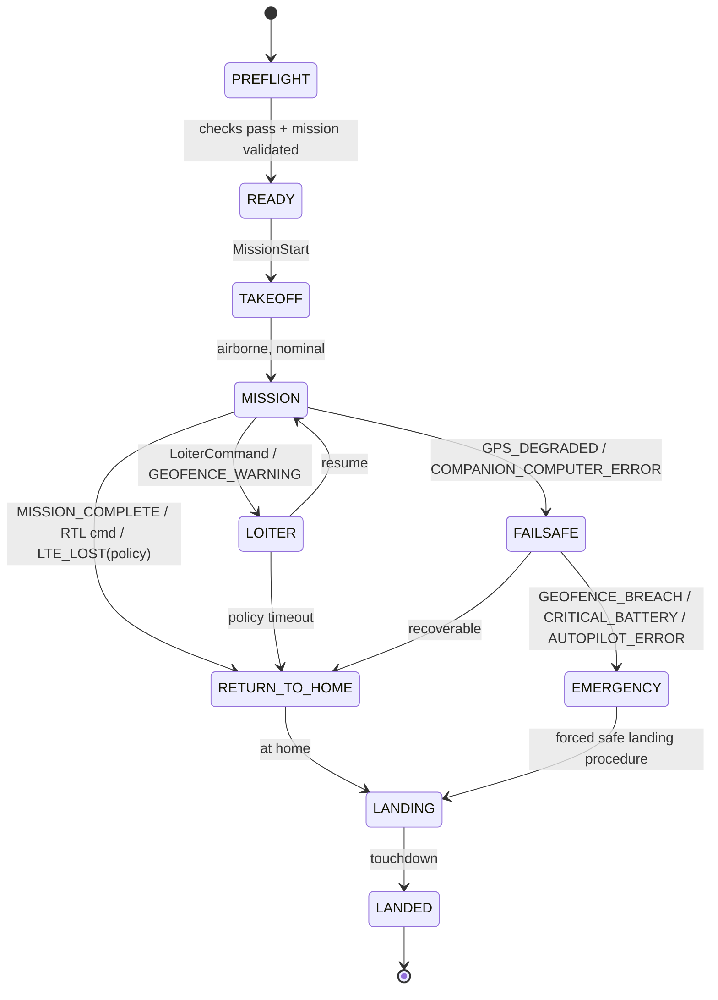

# Safety

This is the most important document in the repository. It will be expanded and revised throughout the project — every failsafe behavior described here must eventually be backed by a fault-injection test (see `TESTING.md`) before being relied on in physical flight.

## Design Principle

At every stage: "What happens if this component disappears right now?"

- Browser disappears → aircraft keeps flying safely.
- Ground backend disappears → aircraft keeps flying safely.
- 4G disappears → aircraft keeps flying safely.
- Companion computer disappears → PX4 invokes its own built-in flight behavior.

A single Internet connection must never be the only thing keeping the aircraft in the sky. See `ARCHITECTURE.md` §4 for the flight-critical / mission-critical / non-critical separation this depends on.

## Failsafe State Machine (initial)

States: `PREFLIGHT`, `READY`, `TAKEOFF`, `MISSION`, `LOITER`, `RETURN_TO_HOME`, `LANDING`, `LANDED`, `FAILSAFE`, `EMERGENCY`.

## Event → Response Policy (initial, to be refined in Phase 6)

| Event | If in TAKEOFF/MISSION | If in LOITER/RTH |
|---|---|---|
| `LTE_LOST` | Continue current mission leg for a configured grace period, then LOITER | No change — already degraded-mode safe |
| `LTE_RESTORED` | Resync telemetry, accept new commands | Resync, operator may resume mission |
| `GPS_DEGRADED` | → FAILSAFE, evaluate severity | → FAILSAFE |
| `GPS_LOST` | → EMERGENCY | → EMERGENCY |
| `LOW_BATTERY` | → RETURN_TO_HOME | continue RTH |
| `CRITICAL_BATTERY` | → EMERGENCY (immediate land) | → EMERGENCY |
| `GEOFENCE_BREACH` | → EMERGENCY | → EMERGENCY |
| `COMPANION_COMPUTER_ERROR` | PX4 falls back to its own built-in RC/GPS failsafes, independent of the companion computer | same |

Key principle: LTE loss alone never escalates past LOITER/RTH. Only degradation of flight-safety-relevant signals (GPS, battery, geofence) escalates to FAILSAFE/EMERGENCY.

## Independent Safety Override

Normal operation is PC/GCS-based, not joystick flying. Real-world flight testing is different: an independent RC safety/abort link, wired directly to the flight controller and bypassing the companion computer entirely, must be present and tested before any physical flight. Normal control and safety override are treated as two separate systems — losing the companion computer or LTE must never remove the safety pilot's ability to take over.

## Regulatory Boundaries

- Comply with applicable EASA rules and national aviation-authority requirements.
- VLOS only unless/until specific BVLOS authorization exists.
- Respect altitude limits, geographic UAS zones, and stay clear of airports, restricted zones, and uninvolved people.
- Any feature that would move the operation into BVLOS or outside the Open category is labeled **SIMULATION / AUTHORIZED OPERATIONS ONLY** and is not flown without the corresponding authorization.
- Development/testing missions are geographically constrained to a predefined test geofence, enforced in software (`SYS-MIS-001`) before it is ever relied on in the air.

## Status

No physical flight has occurred. This document currently describes the *design* of the failsafe system for Phases 0–6 (simulation). It will be updated with real test evidence as Phases 7–9 are reached, and nothing here should be read as validated behavior until backed by a passing fault-injection or flight test.
