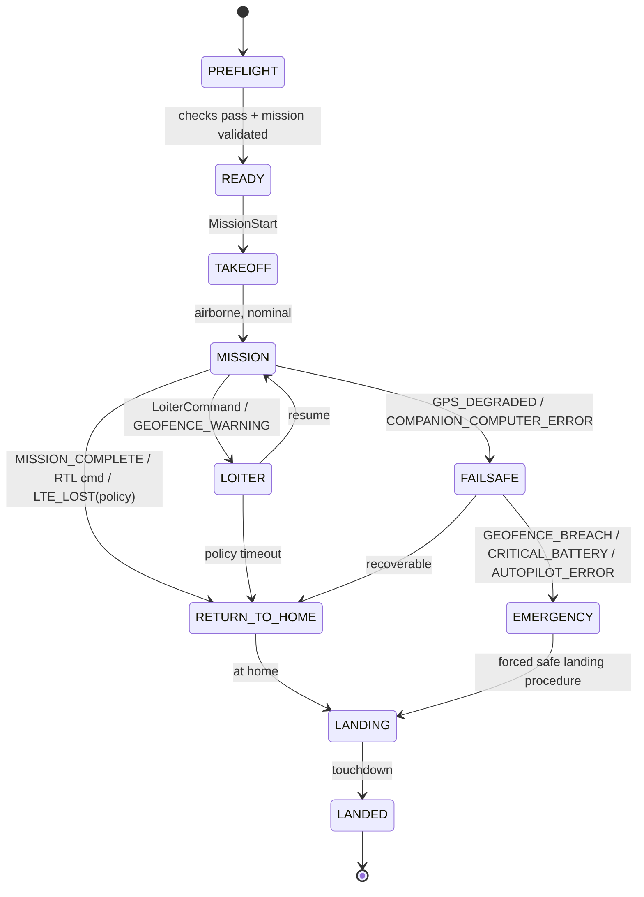

# Safety

This is the most important document in the repository. It will be expanded and revised throughout the project — every failsafe behavior described here must eventually be backed by a fault-injection test (see `TESTING.md`) before being relied on in physical flight.

## Design Principle

At every stage: "What happens if this component disappears right now?"

- Browser disappears → aircraft keeps flying safely.
- Ground backend disappears → aircraft keeps flying safely.
- 4G disappears → aircraft keeps flying safely.
- Companion computer disappears → PX4 invokes its own built-in flight behavior.

A single Internet connection must never be the only thing keeping the aircraft in the sky. See `ARCHITECTURE.md` §4 for the flight-critical / mission-critical / non-critical separation this depends on.

## Failsafe State Machine (initial)

States: `PREFLIGHT`, `READY`, `TAKEOFF`, `MISSION`, `LOITER`, `RETURN_TO_HOME`, `LANDING`, `LANDED`, `FAILSAFE`, `EMERGENCY`.

## Event → Response Policy

| Event | If in TAKEOFF/MISSION | If in LOITER/RTH | Verified |
|---|---|---|---|
| `LTE_LOST` | Mission continues completely unaffected (see note below) | No change | Yes — `tests/simulation/network_outage_during_mission.md`, `link_interruption_reconnection.md` |
| `LTE_RESTORED` | Resync telemetry, accept new commands | Resync, operator may resume mission | Yes — same tests, backend auto-resyncs without a restart |
| `GPS_DEGRADED` | → FAILSAFE, evaluate severity | → FAILSAFE | Not yet tested |
| `GPS_LOST` | → EMERGENCY | → EMERGENCY | Not yet tested |
| `LOW_BATTERY` | Warning, no mode change (below `BAT_LOW_THR`, 15%) | same | Yes — `tests/simulation/battery_failsafe.md` |
| `CRITICAL_BATTERY` | → RETURN_TO_HOME (below `BAT_CRIT_THR`, 7%) | continue | Yes — same test |
| `EMERGENCY_BATTERY` | → EMERGENCY, immediate land (below `BAT_EMERGEN_THR`, 5%) | → EMERGENCY | Yes — same test |
| `GEOFENCE_BREACH` | Pre-flight: refused outright. In-flight: → Return mode per `GF_ACTION` (loiters near home; does not yet auto-land — see note) | → EMERGENCY | Yes — `tests/simulation/geofence_breach.md` |
| `COMPANION_COMPUTER_ERROR` | PX4 falls back to its own built-in RC/GPS failsafes, independent of the companion computer | same | Not yet tested (no separate companion process exists yet) |
| `LIFT_MOTOR_FAILURE` (hover phase only) | Design-only, not yet analyzed against PX4 behavior — a single lost lift motor during takeoff/landing/hover likely means loss of attitude control on a 4-motor layout with no built-in redundancy (unlike a hex/octo), so the realistic outcome may be closer to "not survivable" than "failsafe recovers it." Needs research into whether PX4's VTOL/multicopter failure-detection params (e.g. `FD_FAIL_P`/`FD_FAIL_R` or equivalent) apply here, and whether `sihsim_standard_vtol` can even simulate a motor-out event. | N/A — this event is only meaningful during hover, not during LOITER/RTH cruise flight | Not yet tested — new failure mode introduced by [ADR 0002](docs/adr/0002-quadplane-vtol-airframe.md), did not exist for the pure-fixed-wing design |
| `TRANSITION_FAILURE` (failed or aborted hover↔cruise transition) | Design-only, not yet analyzed. PX4's VTOL transition logic has its own internal checks (airspeed-gated, see `HARDWARE.md`'s Airspeed sensor section) but this project has not yet tested what actually happens if a transition stalls partway or is aborted — whether PX4 reverts safely to the prior flight mode or requires new policy from the (not-yet-built) mission agent. | Same open question applies if a transition were attempted during RTH | Not yet tested — new failure mode introduced by [ADR 0002](docs/adr/0002-quadplane-vtol-airframe.md), did not exist for the pure-fixed-wing design |

**Note on `LTE_LOST`, design vs. actual:** the original design here called for "continue current leg for a grace period, then LOITER" -- a policy-based partial degradation. What's actually configured and tested is simpler: PX4's `NAV_DLL_ACT=0` means an active mission is entirely unaffected by data-link loss, for any duration, with no automatic LOITER fallback at all. This is not a shortfall against the core principle (LTE loss still never threatens flight safety -- if anything it's *more* permissive, since PX4 doesn't second-guess an already-validated mission at all), but it does mean the "grace period then LOITER" policy as originally worded isn't implemented. That would require either a different PX4 configuration (an actual timeout-based `NAV_DLL_ACT` value) or the future onboard mission agent making that call itself -- worth revisiting once that component exists, not before.

**Note on battery events:** split into three tiers matching PX4's real parameters (`BAT_LOW_THR`/`BAT_CRIT_THR`/`BAT_EMERGEN_THR`) rather than the original two (`LOW_BATTERY`/`CRITICAL_BATTERY`), since that's what PX4 actually implements and what we tested against.

**Note on `GEOFENCE_BREACH` recovery:** the failsafe-triggered Return ends in an indefinite loiter near home, not an automatic landing -- distinct from a normal mission's own RTL-with-landing-item flow. Bringing the aircraft down the rest of the way currently needs an explicit follow-up command; there is no "resume mission" or "land now" control in the ground station yet (same gap noted for the RTL-after-latency-test scenario in `tests/simulation/latency_injection.md`). Worth adding to the mission panel.

Key principle, confirmed by testing, not just asserted: LTE loss alone never escalates past normal operation. Only degradation of flight-safety-relevant signals escalates toward FAILSAFE/EMERGENCY -- confirmed for battery; confirmed for geofence, both at the pre-flight gate and for a genuine in-flight breach (PX4 independently enforces its own configured fence, even if our backend's own check were ever bypassed); GPS degradation/loss not yet tested at all (see `tests/simulation/geofence_breach.md` for why -- PX4's failure-injection mechanism isn't available with our current SIH simulator backend).

## Independent Safety Override

Normal operation is PC/GCS-based, not joystick flying. Real-world flight testing is different: an independent RC safety/abort link, wired directly to the flight controller and bypassing the companion computer entirely, must be present and tested before any physical flight. Normal control and safety override are treated as two separate systems — losing the companion computer or LTE must never remove the safety pilot's ability to take over.

## Regulatory Boundaries

- Comply with applicable EASA rules and national aviation-authority requirements.
- VLOS only unless/until specific BVLOS authorization exists.
- Respect altitude limits, geographic UAS zones, and stay clear of airports, restricted zones, and uninvolved people.
- Any feature that would move the operation into BVLOS or outside the Open category is labeled **SIMULATION / AUTHORIZED OPERATIONS ONLY** and is not flown without the corresponding authorization.
- Development/testing missions are geographically constrained to a predefined test geofence, enforced in software (`SYS-MIS-001`) before it is ever relied on in the air.

## Status

No physical flight has occurred. Link-loss, battery-failsafe, and geofence-breach (both pre-flight and in-flight) behavior are all backed by real, passing simulation tests (see the table above); GPS degradation/loss and companion-computer-error are still design-only. `LIFT_MOTOR_FAILURE` and `TRANSITION_FAILURE` are new design-only rows added after the [QuadPlane VTOL decision](docs/adr/0002-quadplane-vtol-airframe.md) — genuinely unanalyzed gaps, not just untested, since they didn't exist as failure modes under the original fixed-wing design at all. These need real investigation (not just a fault-injection test) before Phase 7 hardware decisions that touch the lift-motor system (e.g. single 4-in-1 ESC vs. redundant ESCs, see `HARDWARE.md`) should be treated as settled. This document will continue to be updated with real test evidence as Phases 6-9 are reached, and nothing here should be read as validated behavior until backed by a passing fault-injection or flight test.
